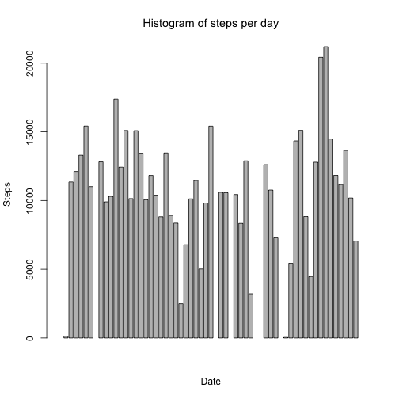
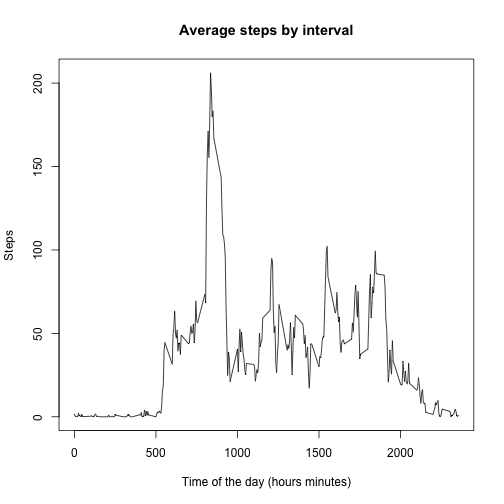
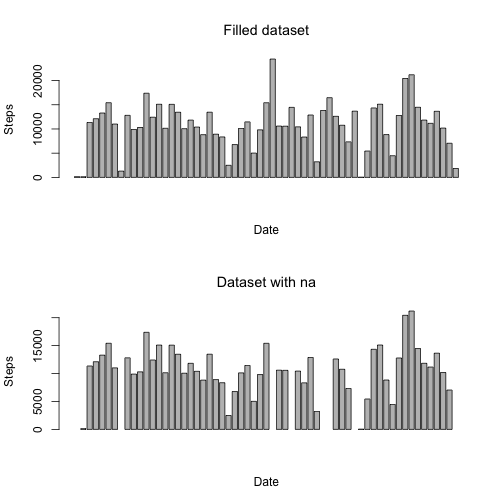
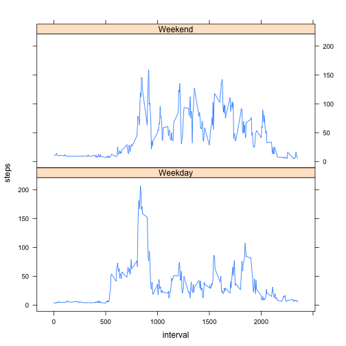

# Reproducible Research: Peer Assessment 1


## Loading and preprocessing the data

```r
    ## Reading data from csv file
    myData<-read.csv("activity.csv",sep=",")
    ## Converting data into numeric (to draw plot it's better)
    myData$steps<-as.numeric(myData$steps)
    ## Suppressing na's
    ## myData<-na.omit(myData)
    ## Aggregate data by day
    aggdata<-aggregate(myData$steps, by=list(myData$date), FUN=sum)
    ## Change names of aggdata DataFrame
    names(aggdata)<-c('Date','Steps')
```


## What is mean total number of steps taken per day?

```r
    ## Draw the histogram
    barplot(aggdata$Steps,main=expression('Histogram of steps per day'), xlab='Date', ylab='Steps')
```

 

```r
    ## Here is the arithmetic mean
    mean(aggdata$Steps, na.rm=TRUE)
```

```
## [1] 10766
```

```r
    ## Here is the median
    median(aggdata$Steps, na.rm=TRUE)
```

```
## [1] 10765
```


## What is the average daily activity pattern?


```r
    ## aggregate by interval
    aggDataByInterval<-aggregate(myData$steps, by=list(myData$interval),FUN=mean, na.rm=TRUE)
    ## Change names of aggdata DataFrame
    names(aggDataByInterval)<-c('Interval','Steps')
    ## Plot
    plot(aggDataByInterval, type='l',xlab='Time of the day (hours minutes)',ylab='Steps',main='Average steps by interval')
```

 

Which 5-minute interval, on average across all the days in the dataset, contains the maximum number of steps?

This is given by taking the row where Steps = max(Steps) and taking the value of the column Interval from this row.

```r
aggDataByInterval[aggDataByInterval$Steps==max(aggDataByInterval$Steps),'Interval']
```

```
## [1] 835
```

## Imputing missing values

We want to calculate and report the total number of missing values in the dataset (i.e. the total number of rows with NAs).

As the function is.na returns a vector of TRUE/FALSE, we may sum the TRUE (=1) values to count the na's values.


```r
sum(is.na(myData$steps))
```

```
## [1] 2304
```

For filling the missing values, we may take the mean of steps of the day. But some days are completely empty. It will give nothing if we take this way. I think it's better to fill the missing values with the mean of the corresponding 5 minutes interval.


```r
## We want to work on a new dataset
myNewData<-myData
## Fill a Data Frame with the mean for every interval
meanDataByInterval<-aggregate(myNewData$steps, by=list(myNewData$interval), FUN=mean, na.rm=TRUE)
names(meanDataByInterval)<-c('interval','steps')
## Fill a Data Frame with the empty values
emptyValuesData<-myNewData[is.na(myNewData$steps),]
## merge both Data Frames
mergedData<-merge(emptyValuesData,meanDataByInterval, by.x='interval',by.y='interval',all=TRUE)
## put the new values in the Data Frame
myNewData[is.na(myNewData$steps),'steps']<-mergedData$steps.y
```

We want to be sure that now we don't have any more na values :

```r
sum(is.na(myNewData$steps))
```

```
## [1] 0
```

Now we want to compare the new filled dataset with the old with na's.

```r
    ## Aggregate data by day
    aggNewData<-aggregate(myNewData$steps, by=list(myNewData$date), FUN=sum)
    ## Change names of aggNewData DataFrame
    names(aggNewData)<-c('Date','Steps')
    ## Separate the plot into two
    par(mfrow=c(2,1))
    ## Draw the histogram
    barplot(aggNewData$Steps,main=expression('Filled dataset'), xlab='Date', ylab='Steps')
    ## Draw the histogram
    barplot(aggdata$Steps,main=expression('Dataset with na'), xlab='Date', ylab='Steps')
```

 

```r
    ## Here is the arithmetic mean
    mean(aggNewData$Steps, na.rm=TRUE)
```

```
## [1] 10766
```

```r
    ## To compare with the old one
    mean(aggdata$Steps, na.rm=TRUE)
```

```
## [1] 10766
```

```r
    ## Here is the median
    median(aggNewData$Steps, na.rm=TRUE)
```

```
## [1] 11015
```

```r
    ## To compare with the old one
    median(aggdata$Steps, na.rm=TRUE)
```

```
## [1] 10765
```

## Are there differences in activity patterns between weekdays and weekends?

We add a weekend/weekday column to the filled dataset.


```r
## Build the dataset
myNewData$weekend<-factor(ifelse(as.POSIXlt(as.Date(myNewData$date))$wday %% 6 == 0, "Weekend", "Weekday"))
## Aggregate the dataset
meanDataByInterval<-aggregate(myNewData$steps, by=list(myNewData$interval, myNewData$weekend), FUN=mean, na.rm=TRUE)
## Change names of the DataFrame
names(meanDataByInterval)<-c('interval','weekend','steps')
## Load the library
library(lattice)
## Draw the plot
xyplot(steps ~ interval | weekend, data=meanDataByInterval, layout=c(1,2), type='l')
```

 
